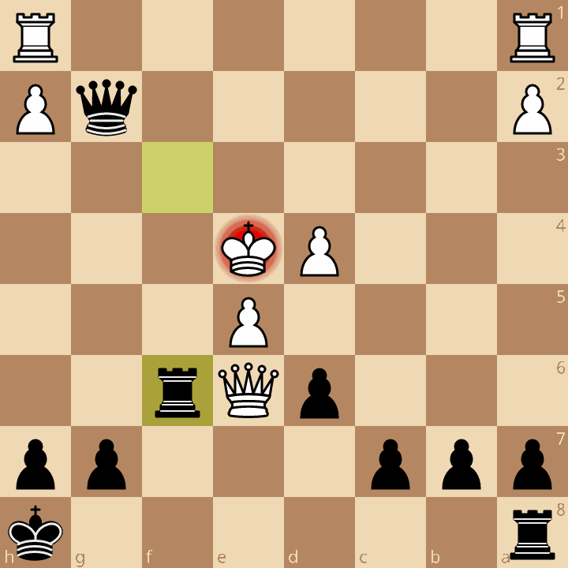

## Example of a lichess game
1. [(here)](https://lichess.org/Ai2HGW2v/black) game `Ai2HGW2v`, I played as blacks
   + PEN: `r6k/ppp3pp/3pQr2/4P3/3PK3/8/P5qP/R6R w - - 2 21`
   + gif with that:
   + 
   + [(here)](lichess_pgn_2024.04.07_Toni_74_vs_hclm.Ai2HGW2v.pgn) PGN for this game
     * PGN is an annotated format
